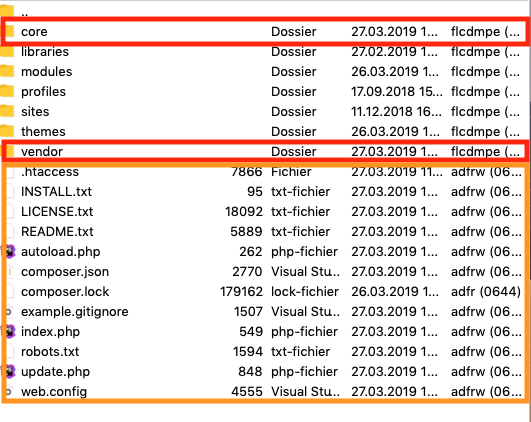

<h1 align="center">Mise à jour de drupal 8</h1>

### 1 - Supprimer tous les fichiers à la racine ainsi que les dossiers "vendor" et "core" 

### 2 - Télécharger la dernière version de Drupal 8

<a href="https://www.drupal.org/download">Le lien pour la dernière version</a>

### 3 - Glisser tous les fichiers à la racine ainsi que les dossiers "vendor" et "core"

